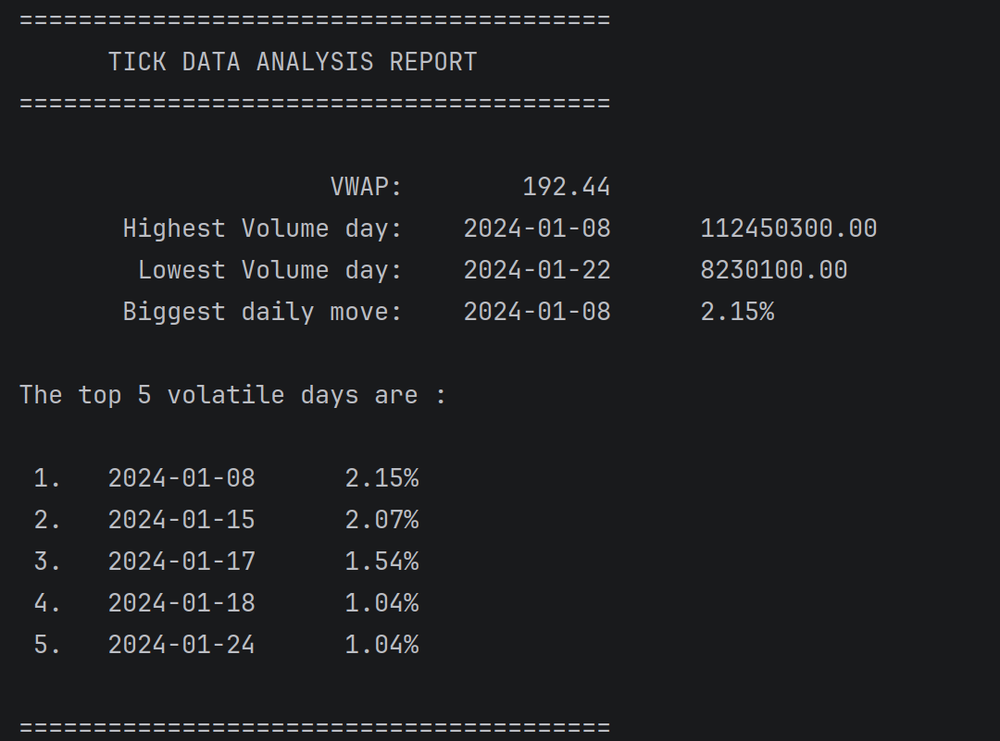

# Tick-Data-Analyzer 

A C++20 command-line tool that parses historical OHLCV stock data
from CSV files containing historical data and computes key financial metrics
used in quantitative trading and market analysis.

## Metrics Computed

- **VWAP** (Volume Weighted Average Price) - weights price by trading
  activity, not a simple average
- **Biggest single-day price move** — largest open-to-close % change
- **Highest and lowest volume trading days** — spots unusual activity
- **Top 5 most volatile days** — ranked by daily price move %

## How to Run

**Compile:**
```bash
g++ -std=c++20 main.cpp -o tick-analyzer
```

**Run:**
```bash
./tick-analyzer
```

Enter the full path to your CSV file when prompted. A sample CSV
is included in `data/Sample-Stock-History.csv` to test immediately.

## Tech

- **Language:** C++
- **Headers:** `iostream`, `fstream`, `sstream`, `vector`,
  `algorithm`, `numeric`, `iomanip`, `cmath`
- **Key STL:** `std::max_element`, `std::min_element`,
  `std::sort` with lambda comparators
- **Data format:** OHLCV CSV
- > Screenshot below shows output on the sample CSV.
> 

